# Validation

I've pursued two key paths for validating the core:

1. I've written several Test Benches and run tests in multiple HDL simulators.  A nice test bench can be so darned helpful for tracking down errors; the notion that you can 'step through' a hardware design is enormously appealing.  The first month or so of development was done entirely in a Test Bench; I didn't move off of a Test Bench until I had every instruction that was "common" (not common being things like `CWAI`).  I returned to Test Benches multiple times to do analyses of clock cycles in scenarios, or to track down something that I knew I wasn't quite grasping.  For those hoping, I don't have a singular Test Bench that's a conclusive check of all things.  I have several, all particular in their purpose.  I realize there's a natural appeal to a one-stop-shop check to see if "ALL IS WELL", but that's a task that I'd call "larger than the CPU implementation itself".  [It's also why there are companies that make their entire income from generating 'Compliance Validation Packages'; look into what a DisplayPort validation package costs today.  There's a reason they're that expensive - frequently validating that everything is done completely within spec and validating that it works correctly is *more* effort than implementing one.]
My test benches have waxed and waned in contents - sections that were early and critical have been deleted, areas commented out and forgotten, and so on.  I haven't included them as they're not terribly useful to anyone. 

2. Most of my validation has been against hard targets.  To do so, I've leveraged a very useful FPGA board that's designed to allow designers to implement against legacy 40-pin DIL devices: A [GODIL board](godil.md).  [Some folks believe almost exclusively in Test Benches.  In certain situations, I'm one of them.  However, as this was intended to be compatible with hard 6809s, and indirectly with existing 6809 systems, testing against real implementations was paramount.]

Anyone interested in using the core would be advised to examine the implementation on the GODIL boards as it is the sole example of utilizing the core to a purely compatible external environment.  A discussion about the GODIL Implementation is [here](godil.md).

## JAMMA

Off-topic, but worth mentioning as there are two JAMMA-connecting boards in this list.  JAMMA stands for Japan Amusement Machine and Marketing Association.  In conventional use, it refers to a connector and wiring harness standard that was introduced in 1985 and quickly became widely followed.  It has standard signalling for multiple types of controllers (buttons, switch joystick, etc.), audio, coin slots, as well as for Component Video output (raster displays in Arcade machines were typically driven by some sort of component signal, often going into an 'RGB board' and that directly driving the display).  

## Williams Arcade Games

I've seen $30 PCBs advertised online that claim to have "300 arcade games!!" on them.  A close enough image of the board reveals that someone put an ARM on a board, loaded up MAME to autostart, a lot of ROMs, VGA output, set up a JAMMA port that interfaces with MAME and then sell the things for pennies.  I'm not interested in critiquing these products more than saying that they aren't something that would interest me.  [For MAME, I already own a PC.  I **do** like MAME and *deeply* respect the effort placed into it, but at the same time it isn't the same thing as a real hardware implementation.  I have a serious touch of idealism here.]

Williams Electronics, Inc. was a corporation founded in 1974, and was responsible for many of the popular arcade games that many of us saw in the 1980s.  Games such as 'Defender' ran on a Motorola MC68A09E. Starting with 'Defender' and then moving into games like 'Stargate', 'Robotron', 'Sinistar' and many others, Williams used generally the same platform from game to game.  A little bit of research shows a large (and somewhat complicated) design, with huge boards full of very old RAM components.  

The product design was actually quite clever; it included a sort of blitter that permitted not only memory moves where action was taken on every cycle (i.e., copying RAM from one location to another requires 1 cycle for read, 1 cycle for write; copying 4K of RAM requires 8192 cycles - far more efficient that the CPU can manage) and also permitted complex actions upon the data.

The blitter places the CPU in HALT mode, waits for acknowledgement from the CPU via the BA signal, does its work, then releases the bus by deasserting /HALT.  The CPU continues as expected.  The scheme is actually a very nifty design.

Consider the many circuit boards of the original arcade game, then recognize the effort required to reduce the design to a few components.

A gentleman who goes by 'JROK' has done exactly that.  Instead of reams of RAMs, he uses a single SRAM.  Instead of battery-backed-up SRAM for high scores, he uses FRAM.  Aside from some buffering and a microcontroller to handle a USB port to allow ROM image installation conveniently, the entire superset of the designs of the Williams arcade machines is encompassed in a single FPGA.  

Here's a picture of JROK's wSYSFPGA:

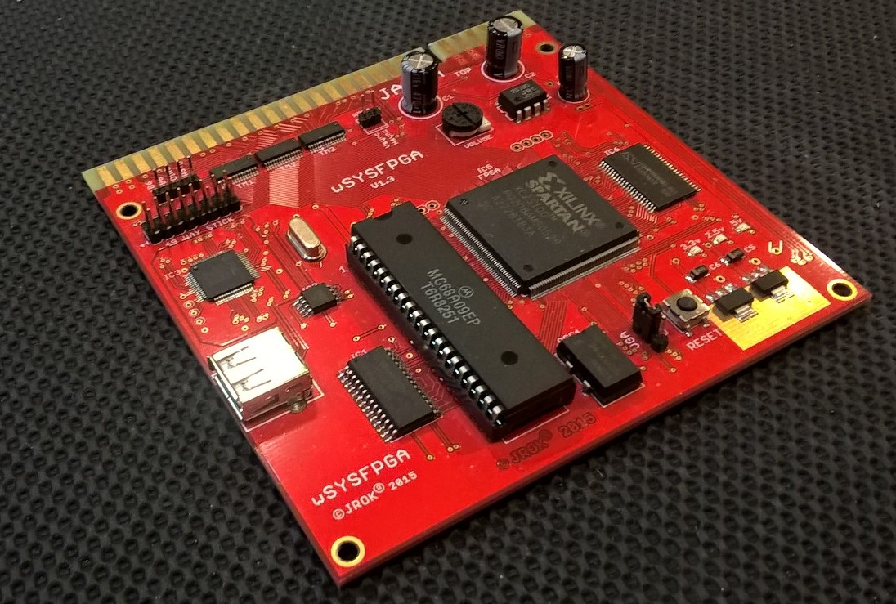

The beauty of these boards is that the designer didn't *emulate* the design; he matched the cycle-level timing perfectly and likely has a design extremely similar to the original schematics.  Believe me, the man has taken a tremendous effort into guaranteeing that he's not "close", he's *exact*.  

The only part that's traditional on JROK's design is a 68A09E.  I suspect that this is partially for legitimacy ("see, it uses a **real** 6809!"), partially for lack of a cycle-accurate model, and partially for cost (real 6809's are quite cheap).

Despite my interest in seeing 6809s embedded inside an FPGA, JROK has generated a wonderful platform for me to validate against.  As a bonus, I haven't seen some of these games in 30 years.

The board is capable of running the superset of Williams boards (the game-to-game hardware designs are all fairly similar, in actuality), meaning that it runs a variety of games.  

My first impression was "If it (the soft cpu on a GODIL board) runs one (game), it will run all of them."  That wasn't entirely true; note 'Stargate' below. 

Removing the hard 6809 and adding a GODIL instead, from two different angles:

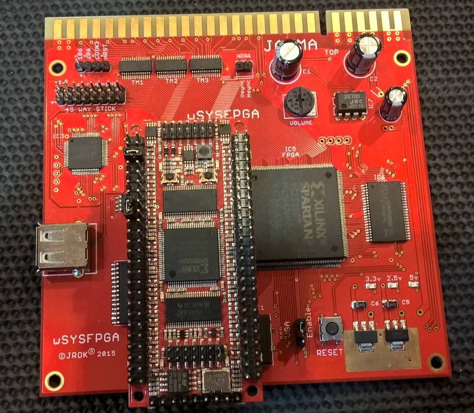

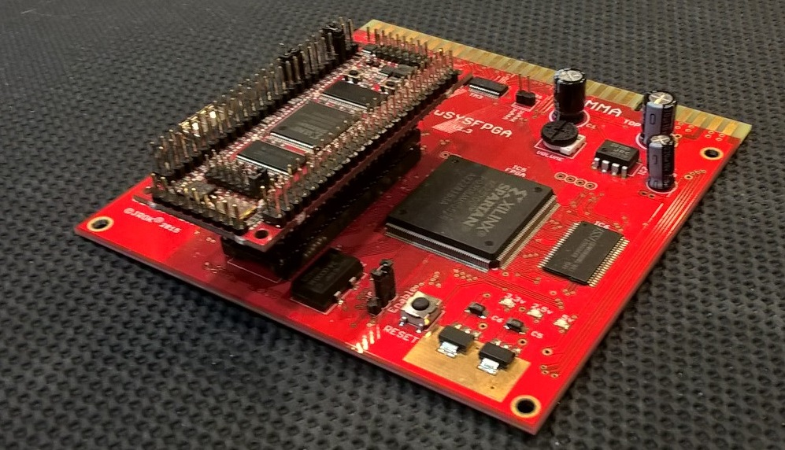

### Interrupt, Bus Timing Challenges

Everything appeared to function fine on this board, however ... 

Erik Gavriluk noticed that JROK had done some work on comparing actual timing on his board against a real set of Williams boards.  His goal was to methodically prove that his FPGA implementation was cycle-accurate against the blitter and the rest of the original Williams boards.  I believe someone had suggested that he was "close" but not accurate.  He went to some effort to demonstrate that he was perfectly accurate.  His timing tests weren't intended to validate the behavior of a CPU, but rather to compare the hard Williams blitter design against his FPGA implementation. He ran with a hard 6809 only - again, his goal was to validate everything *except* the CPU.  Even recognizing that, his timing code still had value for me: it would definitely show variances depending on how my soft core would respond to interrupts and to bus control signals like /HALT and /DMABREQ.  

I contacted JROK and introduced myself.  He was incredibly friendly and helpful - he even sent me preassembled binaries and gave me advice on the best way to get the binaries onto the board. 

His code *did* demonstrate incompatibilities between my soft core and a hard 6809.  In fact, they left me in the nebulous world of "I implemented it exactly according to spec!", while also recognizing that the spec could be interpreted in multiple ways.  The 6809 datasheet is wonderfully detailed, but it isn't perfect.  There's a fair bit of data left out or data inferred but never stated.  

I eventually found three things:

 - I had one fewer /VMA cycles in taking an interrupt than a hard 6809 and needed to add one.  It was, if my memory serves, just after fetching the correct interrupt vector.  That was an outright "oops" situation.

 - /HALT and /DMABREQ have a delay by which they'll be detected.  

 - The datasheet says that the interrupts have a one-cycle delay for synchronization before they can be detected, but they don't actually say where the one cycle is from or to.  Do interrupts have to be asserted before the beginning of a cycle to be valid?  The documentation states that interrupts are sampled on the falling edge of Q.  Is the one cycle from that falling edge of Q to the next falling edge of Q?  

In the end, I spent a fair bit of time timing multiple scenarios on a hard 6809 to note what the behavior was when something (interrupt, /HALT, etc.) was asserted 1 cycle before the next instruction began, 2 cycles, 3, and so on.

It took a fair bit of effort, but was instrumental in ensuring that the soft core not only matched the 6809 datasheet, it matched the 6809's behavior for bus control and interrupts.

Technical details discussed, let's show some of the old Williams games running on the soft core:

(I wish I could include videos; these - especially the sounds - bring back so many memories for me.)

### Defender

(Please forgive the horrible pictures that follow.  I'll find time to take screenshots that aren't quite so wretched.  Believe me, the screen looks great.  Me starting the game and holding a camera that's trying to auto-focus (poorly) made for awful images.  Mea Culpa.)

On the upside, Defender was the first Williams game I tried, and it ran the first time.  

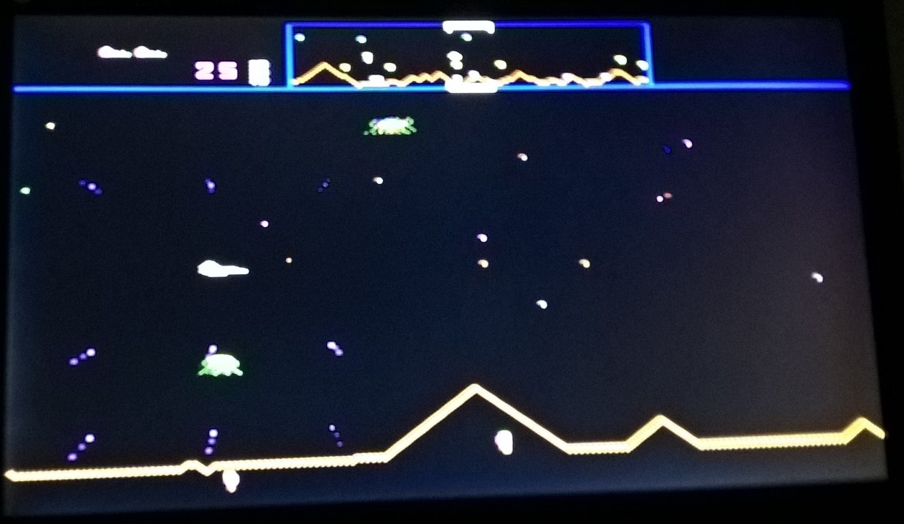

### Robotron

Robotron worked the first time too.  (For those experts, I had the JROK board in a mode where I could use only one joystick (I only have one) and hold a button down to fire; that's why there's no shots on the screen.  :) )

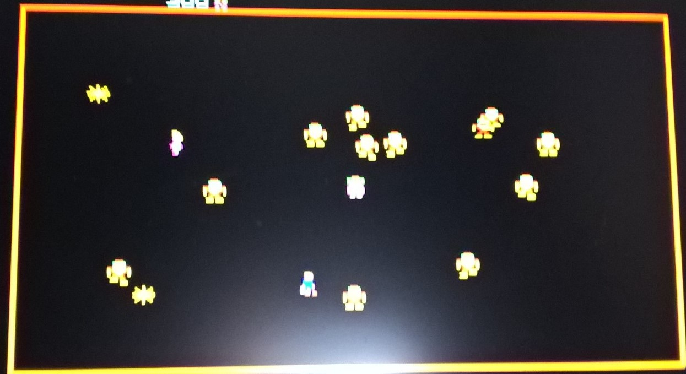

### Sinistar

Ooh, I gotta tell you how much I missed Sinistar.  I ran with a JAMMA harness for a couple of weeks and actually first soldered in a speaker specifically to hear the Sinistar audio.  "I HUNGER"; "RUN, COWARD!", "BEWARE, I LIVE", etc.  Ah, my younger days.  

Sinistar worked fine too:

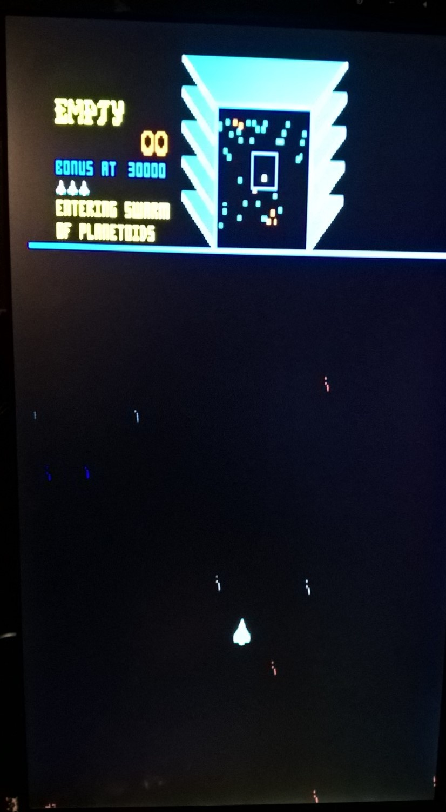

### Stargate

Stargate proved to be the frustrating game in the lot.  **It refused to run**.  My initial reaction was "I goofed somewhere".  At the time, I'd rigged the CPU to 'stop' when it hit an unknown instruction.  It was stopping not too long after RESET.

With the logic analyzer set to capture, I carefully followed along the initialization path of Stargate, and was quickly perplexed.  A branch in a low area of memory was branch into the middle of another instruction - and hitting an invalid instruction.  

My immediate reaction is "I did something wrong that caused this.  Perhaps the CPU fell over, and the busted code was overwritten with garbage?"

I'd commented to Erik Gavriluk about it, and he wasn't quite as confident as I was that the problem was mine. 

Erik set up a MAME run, and determined that the emulated code was indeed doing what I saw on the logic analyzer. The 6809 has incomplete instruction decoding for die space savings.  MAME emulated that behavior, so the game ran on MAME.  

I was stunned.  To this day, I wonder whether the authors realized that they had an error on their ROMs?

I mentioned it to JROK, who seemed to be aware of it.

Erik ended up generating a [patch](patch.md) for it to restore the clearly intended behavior of the code; post-patch, Stargate runs on a 6809, any instantiation of this soft core, and even a HD6309.

I did add multiple methods of dealing with invalid instructions ot the soft core and eventually defaulted to the 'emulate the instructions that a real 6809 would execute when this is encountered' behavior.

Once I was running the same instruction as a hard 6809 (albeit invalid) was, the game ran fine: 

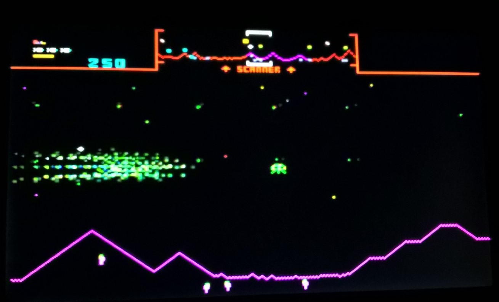

### Blaster

There's something familiar about this, but I'm not sure if I'd seen it in the 1980s or not.  Irrespective, it works fine and I'm no good at the game:

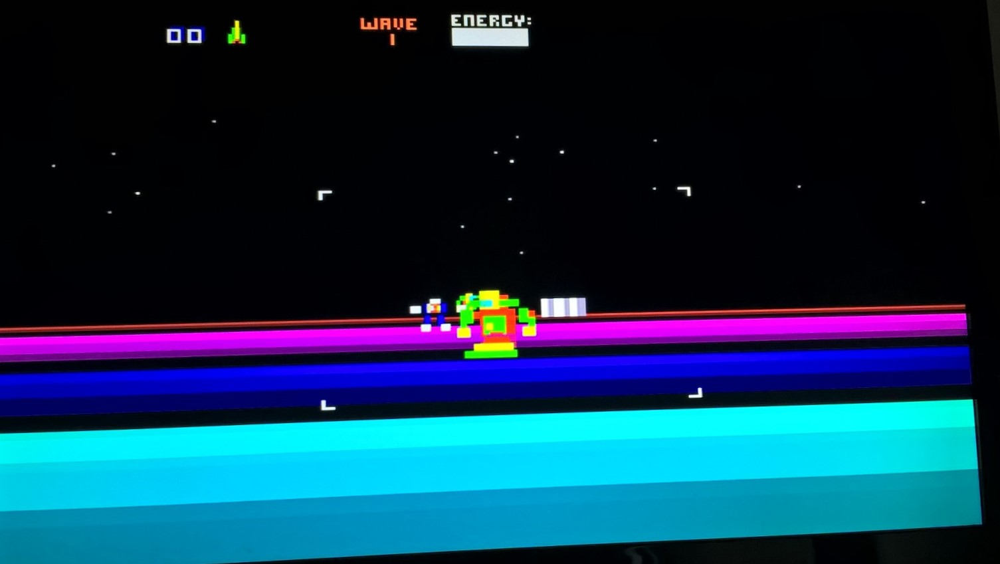

### Joust

This one I remember clearly.  Fun when played two-player (ahem, I haven't bought another joystick for my JAMMA harness yet, so that won't happen here anytime soon ...) - and also worked fine.

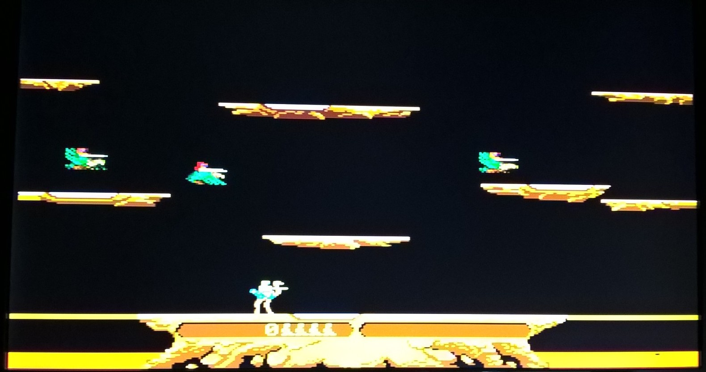

### Bubbles

I never saw this game in the 1980s.  I lived under a rock, clearly.

Worked wonderfully.  I still stink at the game.

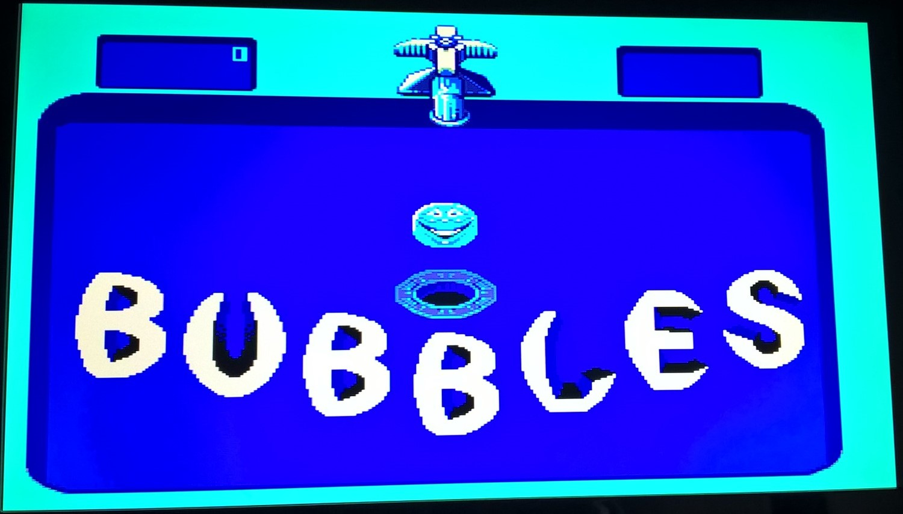

### Splat

Yup, another that I don't recall.  I haven't played this enough to know if I'm truly lousy or impatient (yeah, it works):

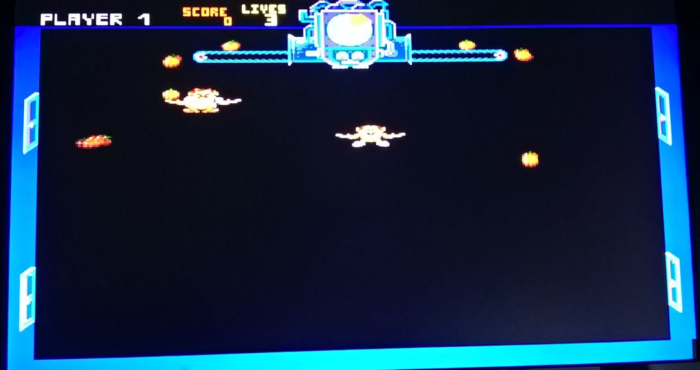

## TRS-80 Color Computer

The TRS-80 Color Computer is the computer that I received sometime between its launch in 1980 and mid 1981.  [I actually don't know exactly when.]

Tandy went through several variations of the design - almost entirely a stock Motorola reference design - before the 'Color Computer 3', which featured faster operation and upgraded video modes.  

Like most computers of the late 70s/early 80s, it shipped not with an 'Operating System', but with a BASIC interprer in ROM.  (Most of these were from Microsoft, although not all.)

My own Color Computer 3 disappeared many years so - sometime after occupying a shelf in my parent's basement in Michigan after I'd taken a job at Commodore. 

Erik apparently has collected several Color Computers; and kindly sent me the one I have here today - a Canadian Color Computer 3, if I guess correctly from the box.

Due to my familiarity with the device (*Dated* familiarity; some things were still quite foggy when I started to utilize it), it seemed to be the perfect target to validate the CPU.

Here's a snapshot of the CoCo 3 in question:

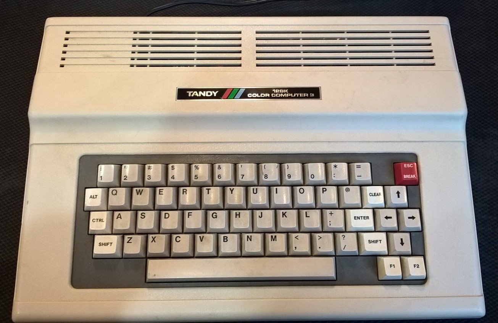

Opened, here's the CPU socket (Note the machined sockets stuffed into the CPU socket - you'll see why in a bit):

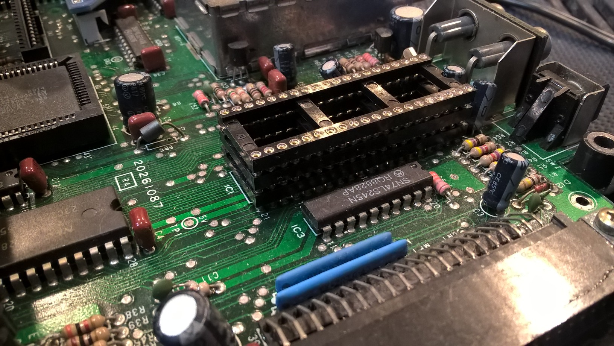

And the GODIL plugged into the CPU socket (note that without the offsets of the sockets, the GODIL board would've hit the top of the Composite Out (the RCA jacks just beyond the CPU socket) frame, and that frame would be grounded.  Not the best scenario.):

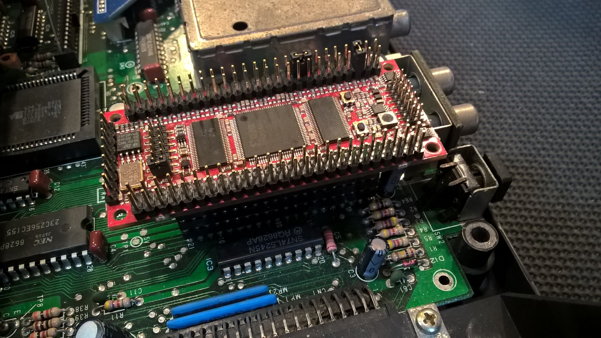

I moved from the similator immediately after having implemented the "complete" set of instructions (well, 'complete' in the sense that I hadn't done things like SYNC and CWAI, which I knew that the Color Computer never used) to testing with a GODIL in the Color Computer.

Referring to 'Color BASIC Unravelled', Logic Analyzer traces, and painful backtracking, I did most of my instruction debugging here.  [This is primarily functionality, rather than cycle-accuracy; cycle-accuracy verification came from multiple source, the largest being a testbench.]

After a few days of effort, I had BASIC booting.  

After about two weeks, the last significant problem (BASIC's soft floating point wasn't working correctly) was discovered - I had been calculating the Overflow bit incorrectly in the 8-bit ALU. Erik frequently ran traces through MESS in this period, which I'd attempt to use to determine where I was getting "off track".

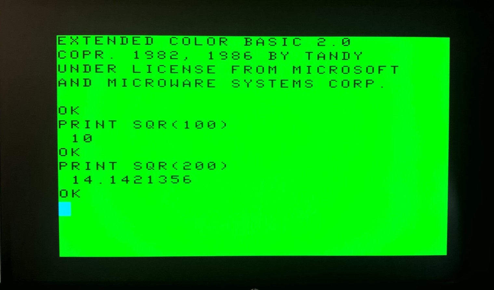  

One detail about the TRS-80 Color Computer - it has the ability to shift its clock generation of E and Q from 0.89Mhz to 1.78Mhz dynamically.  Some versions of the Color Computer could access ROM at the higher speed, but RAM only at the lower speed.  The GODIL application of the core worked just fine in this scenario; the clock rate increasing or decreasing dynamically.  Other systems were generally a variety of clock speeds - 1Mhz, 1.5Mhz, 2Mhz - but the TRS-80 Color Computer was both unusual clock speeds (basically the colorburst frequency /4 and /2) and dynamically switchable between the two.

I did a few other tests - more for amusement than anything else - but did launch 'Color Max Deluxe', which Erik and I had worked on 30 years ago:

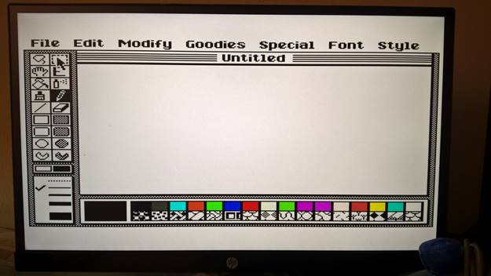

At this point I moved onto the JROK boards and then the Vectrex.

## Vectrex

The Vectrex is a consumer game machine from 1982.  It has a fascinating history, one that's worth reading if you get the urge.  

Unlike most game consoles, this one came *with* a monitor.  It's entirely a vector-based display, and achieves a degree of smoothness that only analog truly can provide.  (Some exaggeration perhaps, but it's a neat device!)

The Vectrex was based on a Motorola MC68A09.  (Note, **not** the 6809E.)

Aside from being neato, I *really* wanted an actual test vehicle for a MC6809.  (Every other platform that I used had utilized the MC6809E, not the MC6809.)

I found one on eBay for cheap enough.  Even better, I got lucky.  Mine has the CPU socketed already.

The differences between a 6809 and a 6809E are primarily in a handful of signals not being bonded out to pins, and different signals being available in lieu.  Instead of relying on external circuitry to generate E and Q, the 6809 proper requires that you provide a clock signal of four times the frequency you wish the E and Q clocks to run at, feed it to the chip, and the E and Q pins are *outputs* rather than inputs.  

A tricky detail with a hard 6809 is that a hard 6809 can drive a crystal.  An FPGA certainly can drive a crystal, but driving one with generic I/O pins on an FPGA isn't the best of ideas.  [I didn't try.  I probably could get oscillations, but it's the wrong idea.]

The Vectrex has a *crystal*.  In fact, it's a 6 Mhz crystal.  

Shoot, that won't work.  I like the Vectrex, and I'd really prefer that it continue to work with a real 6809 as well as my GODIL-driven-soft-core.

So, I pulled it apart and clipped out the crystal.  (And the two capacitors next to it.)

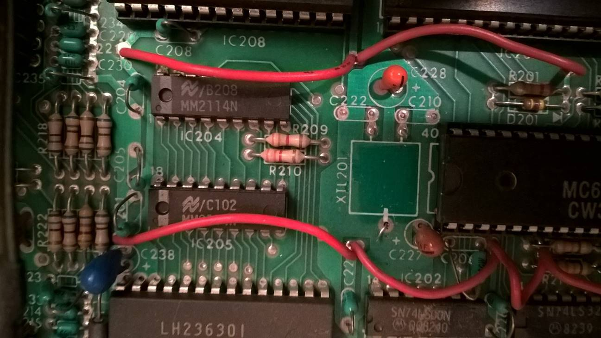

I ordered a 6 Mhz 5V Oscillator, and installed it upside down where the crystal used to be.  I obtained GND from the ground plane that the capacitors were tied to.  I found 5V on the Vectrex schematic off of a nearby pullup resistor.  EXTAL, the clock input on the 6809 was conveniently on one of the two capacitor pads, and I merely had to tie XTAL to ground.

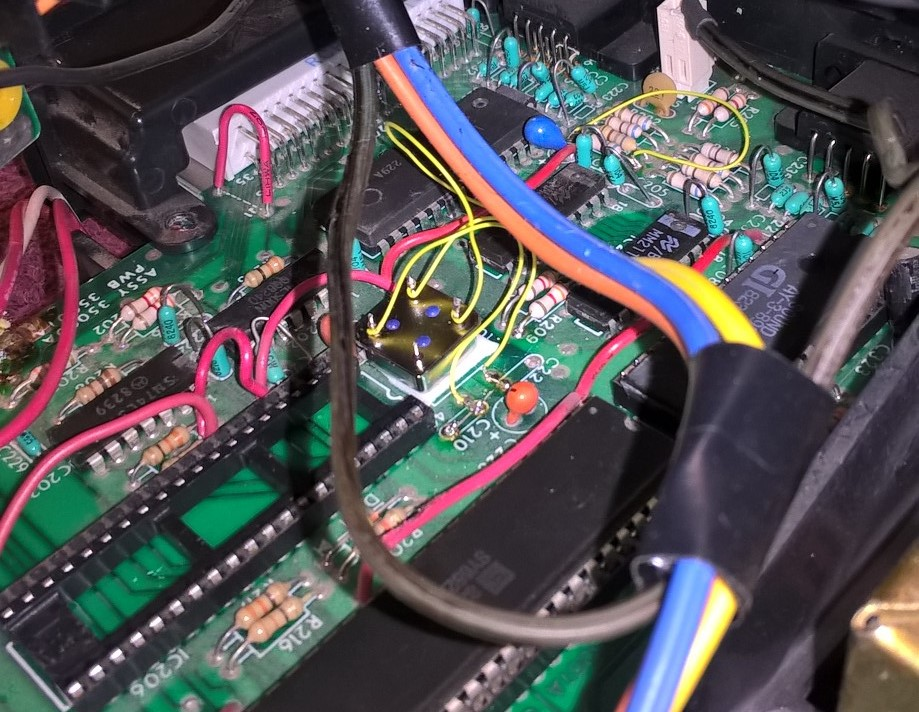

A few minutes later, I found the Vectrex working just fine with the original hard MC6809 and the oscillator instead of the crystal.

One thing to note for anyone working with both the 6809 and the 6809E soft model - put a 5V supply on a 40-pin DIL socket on a piece of perfboard, where the 6809 power and ground lines are wired up.  Use *that* to reflash the GODIL when you're moving from 6809 to 6809E or vice-versa.  Why?  Well, on one, pins like E and Q are inputs, and they're outputs on the other.  Different pins have different purposes.  You're not likely to damage anything, but 5 minutes with an iron and a wall-wart can save you from even a possibiltiy of a problem.

On my first try with the 6809-GODIL, the Vectrex appeared to work wonderfully.  

Then I tried to play some games.

That worked perfectly - except for one problem:

Button 4 of the player-one controller didn't work.  As in "at all".

I've checked my notes; I went to bed the night I discovered that button-4 didn't work without a solution.

The next day (a Saturday, I see), I apparently spent several hours looking at it. 

I chatted with Erik Gavriluk, who scanned the Vectrex EXEC ROM to see how the controllers were read (from the schematic, it was clear that they were tied to inputs on the AY-3-8912 audio chip).  I began to check signals at the AY-3-8912 chip in the Vectrex with the intent of moving backward to the CPU until I figured out what was wrong.  I instantly found the signal incorrect - at the input pin on the AY-3-8912.  [The Vectrex is a bit funky; the controllers are tied to a GPIO port on the AY-3-8912, and it's accessed through the 6522 VIA; a touch more indirect than you'd normally expect.]

It took some checking of the schematic for me to notice that button-4 of the Player 1 controller was connected to the CPU's /FIRQ input.  I suspect that's for the Vectrex Light Pen peripheral or something similar.  

That was enough to sort out the source of the problem quickly.  The GODIL's a very neat piece of work, but it isn't perfect.  It has 5V pull-ups on the 5V side of the 3.3V/5V bidirectional buffers.  The 5V pullup is intended for *output* pins.  The GODIL is ultra-flexible, so you end up with a pullup on every pin (and that includes input pins as well).  (The GODIL has 1.5K pullups.)  

The Vectrex has a 680 ohm resistor in series with every controller input - I assume to protect the AY-3-8912 from hot-plugging controllers.

The 5V pullup and the 680 ohm series resistor literally formed a voltage divider.  My notes say that I calculated and measured 1.6V on the button-4 input to the AY-3-8912 when it was depressed.  Uh, oops?  VIL for the AY-3-8912 is listed as 0.6V.  Yeah, that's not a grounded-out line, and entirely explains why the button didn't appear to work.

I considered this for a bit:  I could desolder the pullup on the GODIL.  I disliked that as I've considered using the GODIL for other parts other than a 6809 - and it seemed unpleasant to remove and readd later.  I could also short out the 680 Ohm resistor instead.  (Note, one is an 0204 resistor in very close quarters and the other is an axial resistor.)

Neither was ideal.  I chose to short the 680 Ohm resistor (my notes show that it was R225); a bit of wire-wrap tack-soldered to each side of the axial resistor and - the button now worked once more.  Recall that I wanted to leave the Vectrex usable with the original CPU when I was done, so damaging it wasn't my favorite choice. Once I was done, I could very easily remove the short.  (You can see the yellow wire I used to short the resistor messily soldered onto R225 in the picture of the oscillator, above - look at the top of the image.)

It's worth showing the Vectrex with the GODIL running a 6809:

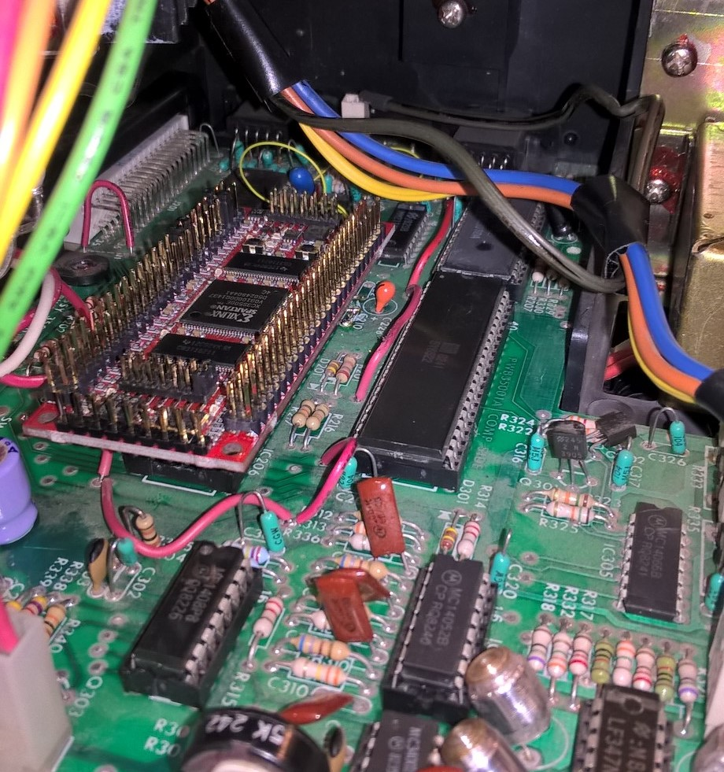

The Vectrex worked wonderfully.  I played quite a few games (none of which I was actually any good at) and was generally thrilled about how neat a device it is.

The Vectrex with the GODIL running playing 'Armor Attack': (crummy picture quality; my fault)

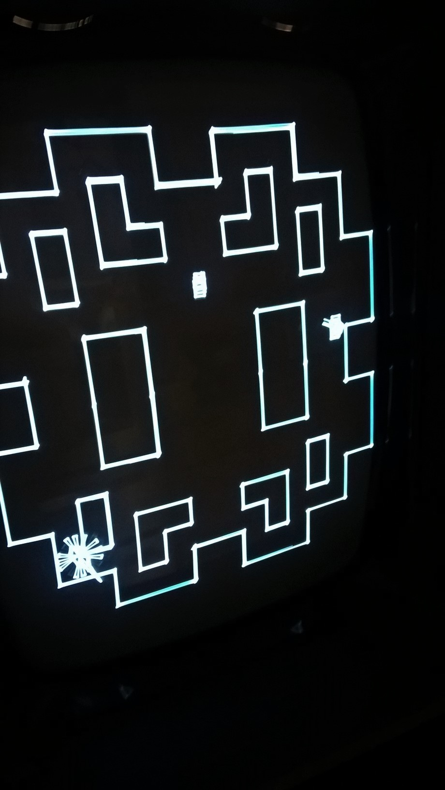

In retrospect, I was very fortunate on the Vectrex - the lengthy debug work had already happened on other platforms.  The things that the Vectrex tested was more the 6809 vs. 6809E model, clocking, etc.  It was pleasant to - mostly - have it "just work".  

## Taito Arcade Games

Recall the fellow JROK that I mentioned before?  He's .. prolific.  The man has created quite a few boards on quite a few arcade recreations on FPGAs.  

After he tackled the Williams designs, he went further and worked on reimplementing the Taito hardware, and created his ZooQ board:

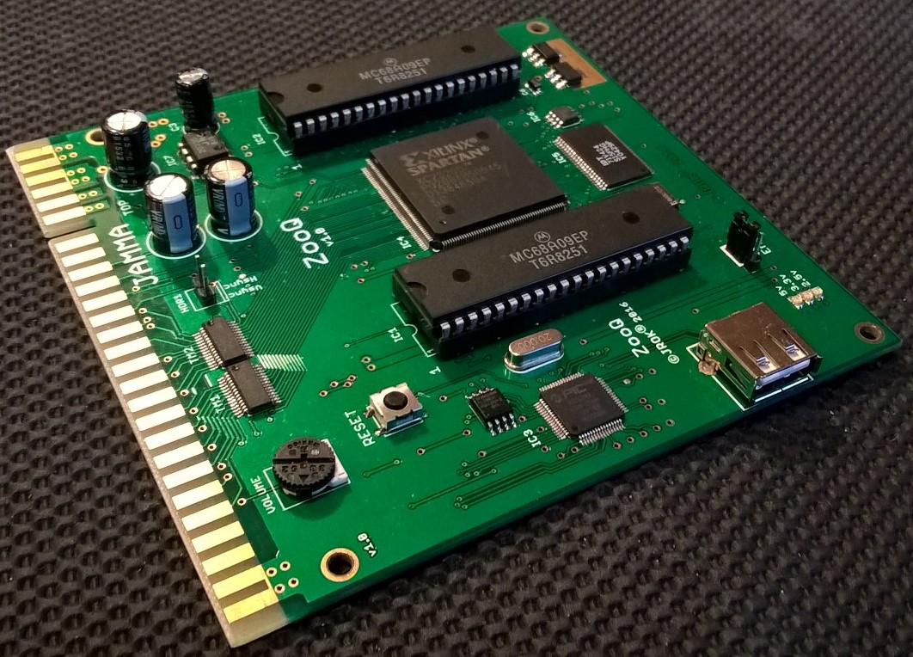

Note that it has *two* MC68A09E's onboard.  

One is used for gameplay, the other for video.  

This was a double-whammy for me.  Two 6809s.  They don't actually run on the same bus - although the 6809E is capable of doing that (with stunning inefficiency) - but they do communicate through 1K of shared RAM.  

I tested against the ZooQ infrequently; it wasn't intentional - it was mostly convenience. It *was* good to have around, as you'll see as you cycle through the games, as it detected something while I was editing this document.

Here's a snapshot of the ZooQ board w/ two GODILs running while I took the (poor) snapshots below:

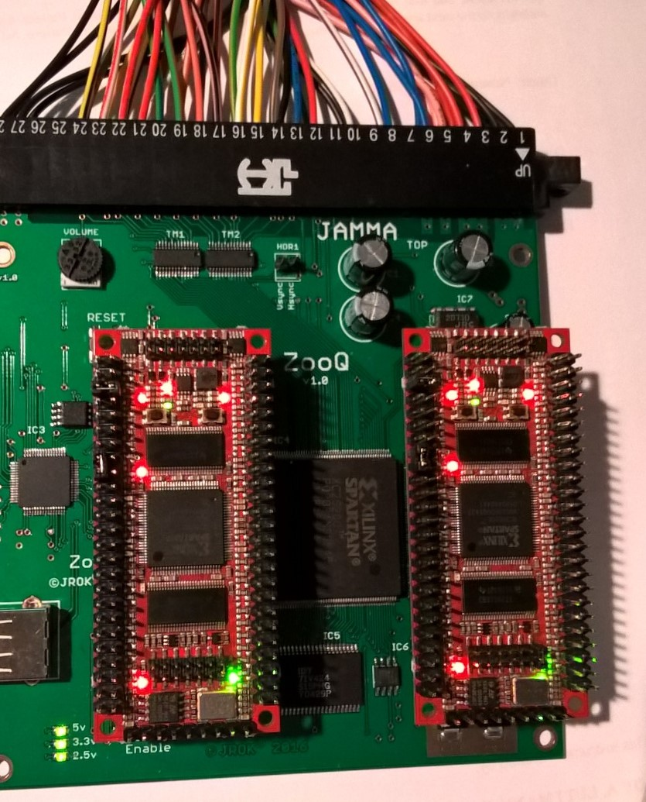

### QIX

Hey, another one of my favorite arcade machines from the 1980s!  I didn't know back then that it ran on one, much less two 6809s!

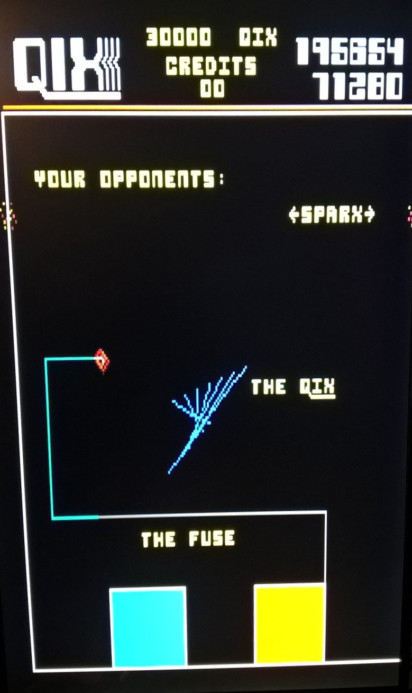

### QIX-II

I have a vague memory of a QIX-II.  Not significant, but loose ...

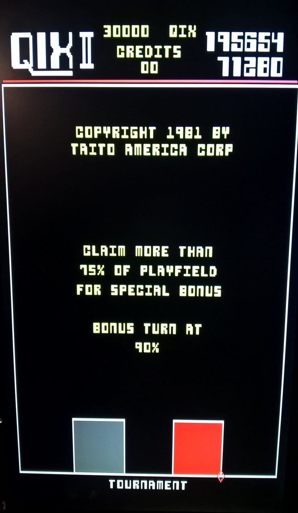

### ZOOKEEPER

Basically all of the rest of the Taito games aren't things I recall.  Or rather, perhaps I saw it and never stuffed a quarter into it?  Who knows ... 

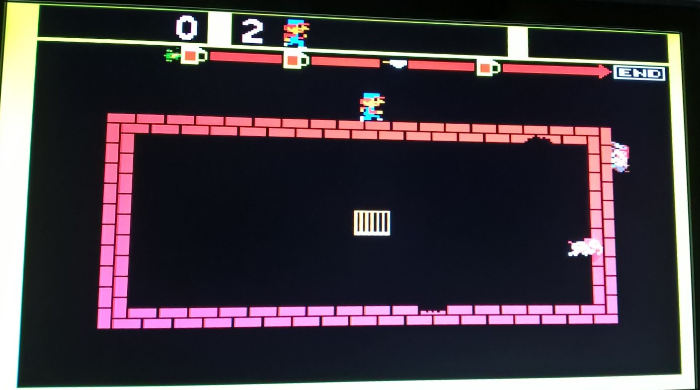

### KRAM

The name seems .. unique.

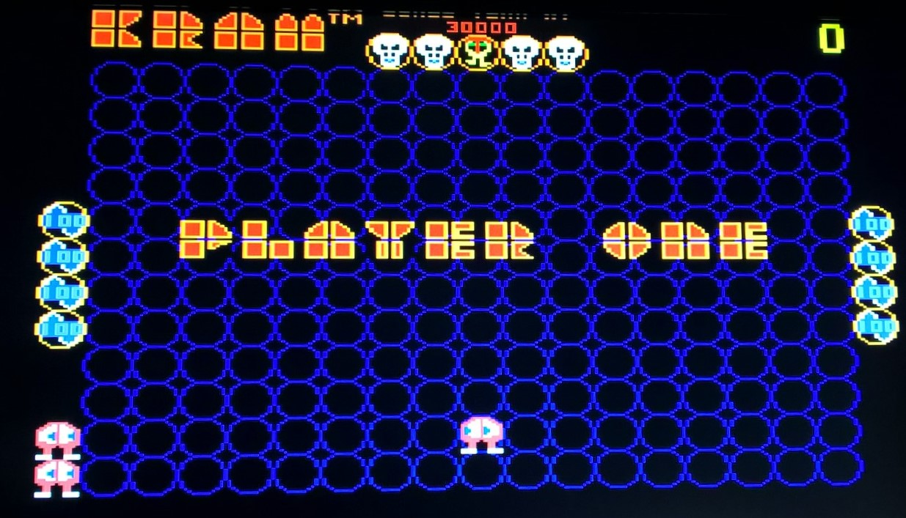

### ELECTRIC YOYO

And here's the item that caught a mistake at the last instant.  I was editing this file and taking the (really awful) screenshots when I found that Electric Yoyo froze.

I yanked the GODILs, stuffed slots with hard 6809Es, and it worked fine.  Back to GODILs, dead.  I eventually found that whatever was going wrong was on the 'game' or 'main' CPU, not the video CPU.  

I disassembled the ROMs, made a nice long file to review, and wired up the logic analyzer.  Yeah, it seemed to be going off of the rails.  I made a change and rebuilt the design to STOP on an illegal instruction.  This has always been the best way for me to stop the chaos once things start to go wrong.  'DEAD' appears on the address bus in this case, and I can usually start scanning back in the analyzer buffer to narrow down where things went **bad**.  

And found it, I did.  Amazingly, it was an error I'd introduced a month or so ago by cleaning up the design (but hadn't noticed; Electric YoYo was doing an interesting pattern of code that isn't frequently seen).  It wasn't in the original implementation, but when I rewrote a segment to be more readable, I goofed.  Whups.

Erik pointed out after I'd sorted the problem out that if I'd run the testbench (which I hadn't kept up-to-date), it would've been caught.  He's right.  I hadn't run that code since the recent clean-up change that generated the problem.  Perhaps a future update will be to clean up the incomplete testbench and include it.  

Despite my not being entirely sure how to play Electric Yoyo, it has my appreciation for pointing me to a (subtle) screwup.

Oh, and yeah - now it works fine:

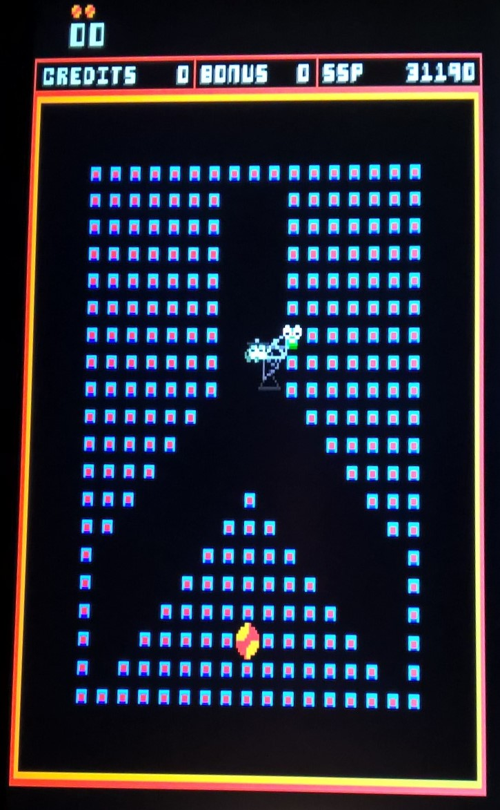

### SPACE DUNGEON

Not a clue about this guy, other than it seems to run and I don't remember it at all: 

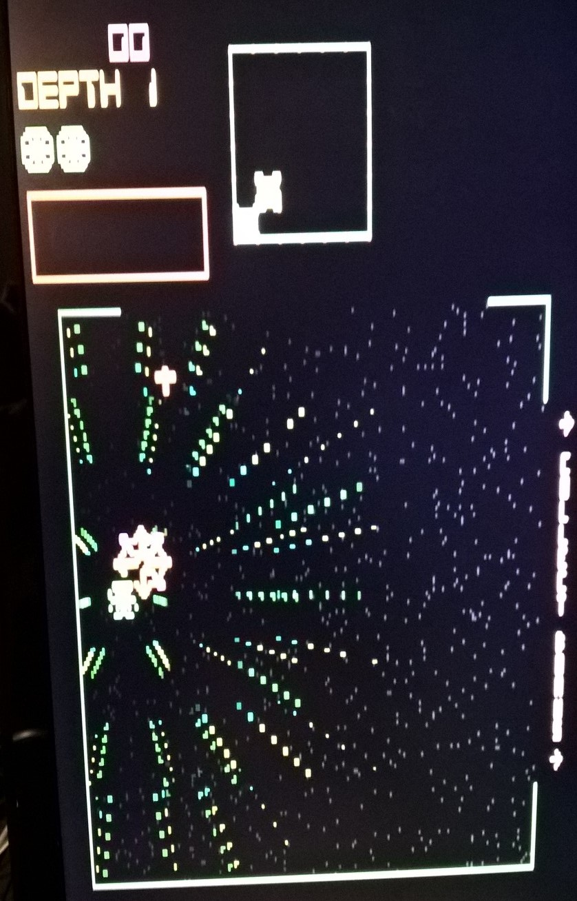

### COMPLEX X

The last of the bunch, Complex X:

## PLATFORMS I'D LOVE TO TEST AGAINST, BUT DIDN'T

 - The Star Wars Arcade game from the early 1980s.  A very neat vector based game. If you have one and are willing to give something a whirl, contact me.  

 

